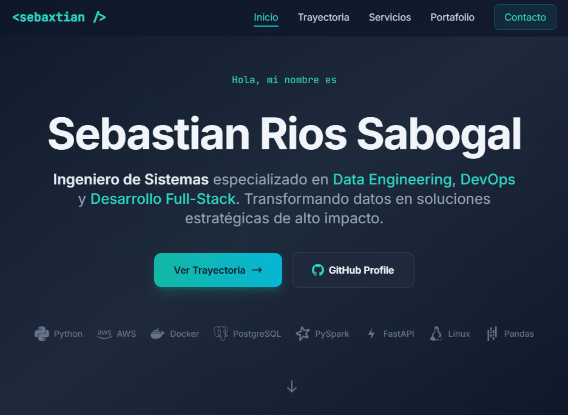

# Portfolio Website - Sebastian Rios Sabogal

A professional, high-conversion portfolio website showcasing the expertise of **Sebastian Rios Sabogal**, a Data Engineer, DevOps & Full-Stack Specialist. This project serves as a digital gateway to his technical trajectory, combining corporate excellence with social impact.

<div align="center">
  
  <br>
  <h3>Data Engineering | DevOps | Full-Stack Development</h3>
  <p><i>"Transforming data into high-impact strategic solutions."</i></p>
  
  [](https://www.linkedin.com/in/sebastianriossabogal/)
  [](https://github.com/sebaxtian/)
  [](https://sebaxtian.dev/)
</div>

---

## 🚀 Key Features

- **Modern Dark Theme** - Professional design with teal accents
- **Fully Responsive** - Optimized for all devices (mobile, tablet, desktop)
- **SEO Optimized** - Meta tags, Open Graph, and structured data
- **High Performance** - Lazy loading, optimized assets
- **Accessible** - WCAG 2.1 AA compliant
- **Interactive** - Smooth animations and transitions
- **Multi-language Support** - Full bilingual system (Spanish/English)

---

## 📁 Project Structure

```bash
portfolio/                  # Root directory
├── index.html              # Language detection & auto-redirect
├── css/                    # Custom CSS styles and animations
│   └── styles.css
├── js/                     # JavaScript interactions
│   └── main.js
├── assets/                 # Asset folder
│   ├── images/             # Branding assets, favicons, flags
│   └── documents/          # Placeholder for documents (CV, etc.)
├── es/                     # Spanish version
│   └── index.html          # Complete Spanish content
├── en/                     # English version
│   └── index.html          # Complete English content
├── templates/              # Versioned evolution of the design (v1, v2, v3)
├── plans/                  # Strategic roadmaps and project planning
└── README.md               # This documentation
```

---

## 🌍 Internationalization (i18n) System

This portfolio implements a complete **static multi-language system** using a route-based architecture optimized for SEO and performance.

### Architecture Overview

The i18n system uses a **static routing approach** where each language has its own dedicated directory with complete HTML files. This architecture provides:

- **Maximum SEO Performance**: Search engines can easily index language-specific URLs
- **Browser Caching**: Each language version can be cached independently
- **No Runtime Overhead**: No JavaScript required to load translated content
- **Simple Maintenance**: Each language version is a complete, standalone HTML file

### Supported Languages

| Language | Code | Directory | Flag |
|----------|------|-----------|------|
| Spanish (Español) | `es` | `/es/` |  |
| English | `en` | `/en/` |  |

### Language Detection Flow

```
User visits sebaxtian.dev
         │
         ▼
┌─────────────────────────────┐
│  Check localStorage         │
│  for 'preferredLang'        │
└─────────────────────────────┘
         │
    ┌────┴────┐
    │ YES     │ NO
    ▼         ▼
┌───────┐  ┌──────────────────────┐
│Use    │  │ Check navigator.lang │
│saved  │  │ or navigator.userLang│
│pref   │  └──────────────────────┘
└───────┘         │
                 ▼
          ┌──────────────┐
          │Detect 'es'   │
          │or 'en' prefix│
          └──────────────┘
                 │
                 ▼
    ┌────────────────────────┐
    │ Redirect to /es/ or /en/│
    └────────────────────────┘
```

### Directory Structure

```
Root/
├── index.html           # Language detection + redirect
├── es/
│   └── index.html       # Full Spanish content
└── en/
    └── index.html       # Full English content
```

### Initial Setup

1. **Clone or download the repository**

2. **Deploy to a web server**: The i18n system requires a web server to work properly (not file:// protocol)

3. **Configure your domain**: Ensure your web server is configured to serve the correct files

4. **Test the language detection**:
   - Visit `https://sebaxtian.dev/` - Should redirect based on browser language
   - Visit `https://sebaxtian.dev/es/` - Shows Spanish version
   - Visit `https://sebaxtian.dev/en/` - Shows English version

### Language Switcher

The language switcher is integrated into the navigation bar:

**Spanish Version** (in `es/index.html`):
```html
<a href="#" onclick="switchLanguage('en'); return false;" 
   class="flex items-center space-x-1 text-slate-300 hover:text-teal-400"
   aria-label="Switch to English">
    
    <span class="text-xs font-bold uppercase">EN</span>
</a>
```

**English Version** (in `en/index.html`):
```html
<a href="#" onclick="switchLanguage('es'); return false;" 
   class="flex items-center space-x-1 text-slate-300 hover:text-teal-400"
   aria-label="Cambiar a Español">
    
    <span class="text-xs font-bold uppercase">ES</span>
</a>
```

### Language Switcher Function

The `switchLanguage()` function handles language switching:

```javascript
window.switchLanguage = function(targetLang) {
    // Save user preference to localStorage
    localStorage.setItem('preferredLang', targetLang);
    
    // Get current hash (anchor) to preserve position
    var currentHash = window.location.hash || '';
    
    // Redirect to the selected language
    window.location.href = '/' + targetLang + '/' + currentHash;
};
```

**Key Features**:
- Saves preference to `localStorage` for future visits
- Preserves current page position (anchor) when switching
- Provides immediate feedback

---

## 📋 Adding New Languages

To add a new language to the system, follow these steps:

### Step 1: Create the Language Directory

```bash
mkdir -p fr  # Example: French
```

### Step 2: Create the HTML File

Copy the English version as a template:
```bash
cp en/index.html fr/index.html
```

### Step 3: Update the HTML Content

1. Change the `lang` attribute:
   ```html
   <html lang="fr">  <!-- French -->
   ```

2. Update the `hreflang` tags in the `<head>`:
   ```html
   <link rel="alternate" hreflang="fr" href="https://sebaxtian.dev/fr/" />
   <link rel="alternate" hreflang="es" href="https://sebaxtian.dev/es/" />
   <link rel="alternate" hreflang="en" href="https://sebaxtian.dev/en/" />
   <link rel="alternate" hreflang="x-default" href="https://sebaxtian.dev/" />
   ```

3. Update meta tags (title, description, Open Graph):
   ```html
   <meta name="description" content="[French description]">
   <meta property="og:url" content="https://sebaxtian.dev/fr/">
   <meta property="og:description" content="[French description]">
   ```

4. Translate all visible content (navigation, sections, footer)

### Step 4: Create the Flag Asset

Add a flag image to `assets/images/`:
- Format: SVG (recommended)
- Naming: `flag-{country-code}.svg` (e.g., `flag-france.svg`)
- Recommended size: 24x16px or similar aspect ratio

### Step 5: Update the Language Switcher

In each existing language file, add a button for the new language:

```html
<a href="#" onclick="switchLanguage('fr'); return false;" 
   class="flex items-center space-x-1 text-slate-300 hover:text-teal-400"
   aria-label="Switch to French">
    
    <span class="text-xs font-bold uppercase">FR</span>
</a>
```

### Step 6: Update Root index.html (Optional)

If you want the new language to be included in automatic detection, update the root `index.html`:

```javascript
// Add new language to detection logic
var lang = localStorage.getItem('preferredLang');

if (!lang) {
    var navLang = navigator.language || navigator.userLanguage;
    if (navLang.startsWith('es')) {
        lang = 'es';
    } else if (navLang.startsWith('fr')) {  // Add French detection
        lang = 'fr';
    } else {
        lang = 'en';
    }
}
```

---

## 🔧 Frontend Usage Examples

### Using the Language Switcher in Components

The language switcher can be integrated into any component. Here's an example:

**Navigation Bar Integration**:
```html
<!-- Desktop Navigation -->
<div class="hidden md:flex items-center space-x-8">
    <a href="#inicio" class="nav-link">Inicio</a>
    <a href="#experiencia" class="nav-link">Trayectoria</a>
    <a href="#skills" class="nav-link">Servicios</a>
    
    <!-- Language Switcher -->
    <a href="#" onclick="switchLanguage('en'); return false;" 
       class="flex items-center space-x-1 text-slate-300 hover:text-teal-400 ml-4">
        
        <span class="text-xs font-bold uppercase">EN</span>
    </a>
</div>

<!-- Mobile Navigation -->
<div class="md:hidden" id="mobile-menu">
    <a href="#inicio" class="mobile-nav-link">Inicio</a>
    <a href="#experiencia" class="mobile-nav-link">Trayectoria</a>
    <a href="#skills" class="mobile-nav-link">Servicios</a>
    
    <!-- Mobile Language Switcher -->
    <a href="#" onclick="switchLanguage('en'); return false;" 
       class="block px-4 py-2 text-slate-300 hover:text-teal-400 text-center">
        🇺🇸 English
    </a>
</div>
```

### Creating Language-Specific Links

For internal links within the same language:

```html
<!-- Spanish version links to English -->
<a href="/en/#experiencia">View in English</a>

<!-- English version links to Spanish -->
<a href="/es/#experiencia">Ver en Español</a>
```

---

## 🔧 Backend Considerations

Since this is a static website, there's no traditional backend. However, the i18n system interacts with:

### localStorage

```javascript
// Setting preference
localStorage.setItem('preferredLang', 'es');

// Getting preference
var preferredLang = localStorage.getItem('preferredLang');
// Returns: 'es', 'en', or null
```

### URL Structure

The system uses URL-based routing:

| URL | Content |
|-----|---------|
| `/` | Redirects to `/es/` or `/en/` |
| `/es/` | Spanish version |
| `/en/` | English version |
| `/es/#experiencia` | Spanish version, Experience section |
| `/en/#experiencia` | English version, Experience section |

---

## 📝 Content Management

### Static Content

Each language version contains fully translated static HTML:

- **Navigation**: Menu items, language switcher
- **Hero Section**: Headlines, descriptions, CTAs
- **Services**: Service descriptions, features
- **Experience**: Job titles, descriptions, dates
- **Portfolio**: Project titles, descriptions, technologies
- **Contact**: Contact information, form labels
- **Footer**: Social links, copyright

### Dynamic Considerations

The current implementation uses **static content** per language. For future dynamic content:

1. **JSON Translation Files**: Could be added for dynamic text
2. **API-Based i18n**: Could fetch translations from an API
3. **JavaScript i18n Library**: Libraries like i18next could be integrated

---

## ⚡ Performance & Caching

### Performance Optimizations

- **Static HTML**: Each language version is pre-rendered HTML
- **No Translation Loading**: No runtime JSON fetching needed
- **Minimal JavaScript**: Only for language switching functionality
- **Optimized Assets**: Flags are lightweight SVG files

### Caching Strategy

The static routing enables efficient caching:

| Resource | Cache Behavior |
|----------|----------------|
| `/es/index.html` | Can be cached separately |
| `/en/index.html` | Can be cached separately |
| `/css/styles.css` | Shared, cached once |
| `/js/main.js` | Shared, cached once |
| `/assets/images/*` | Shared, cached once |

### Browser Caching Headers

Recommended server configuration (nginx example):

```nginx
# Cache HTML files for 1 hour
location ~* \.html$ {
    expires 1h;
}

# Cache static assets for 1 year
location ~* \.(css|js|jpg|png|svg)$ {
    expires 1y;
    add_header Cache-Control "public, immutable";
}
```

---

## 🔍 SEO Configuration

### Hreflang Tags

Each language version includes proper hreflang tags:

```html
<link rel="alternate" hreflang="es" href="https://sebaxtian.dev/es/" />
<link rel="alternate" hreflang="en" href="https://sebaxtian.dev/en/" />
<link rel="alternate" hreflang="x-default" href="https://sebaxtian.dev/" />
```

**Benefits**:
- Tells search engines about alternate language versions
- Helps Google show the correct language version in search results
- Prevents duplicate content issues

### Meta Descriptions

Each language version has unique, language-specific meta descriptions:

**Spanish** (`es/index.html`):
```html
<meta name="description" content="Sebastian Rios Sabogal - Ingeniero de Sistemas especializado en Data Engineering, DevOps y desarrollo Full-Stack. Transformando datos en soluciones tecnológicas de alto impacto.">
```

**English** (`en/index.html`):
```html
<meta name="description" content="Sebastian Rios Sabogal - Systems Engineer specializing in Data Engineering, DevOps, and Full-Stack development. Transforming data into high-impact technological solutions.">
```

### Open Graph Tags

Language-specific Open Graph URLs:

```html
<!-- Spanish -->
<meta property="og:url" content="https://sebaxtian.dev/es/">

<!-- English -->
<meta property="og:url" content="https://sebaxtian.dev/en/">
```

---

## 🔧 Troubleshooting

### Common Issues and Solutions

#### 1. Language Detection Not Working

**Symptoms**: Page redirects to wrong language

**Solutions**:
- Check browser's language settings
- Clear localStorage: `localStorage.removeItem('preferredLang')`
- Verify the root `index.html` script is executing

**Debug**:
```javascript
// In browser console
console.log('Browser language:', navigator.language);
console.log('Stored preference:', localStorage.getItem('preferredLang'));
```

#### 2. Language Switcher Not Working

**Symptoms**: Clicking language switch does nothing

**Solutions**:
- Check browser console for JavaScript errors
- Verify the `switchLanguage` function is defined
- Ensure the onclick handler is properly set

**Debug**:
```javascript
// Test function directly
switchLanguage('en');  // Should redirect to /en/
```

#### 3. Styles Not Loading After Language Switch

**Symptoms**: Page appears unstyled after switching languages

**Solutions**:
- Verify assets use absolute paths (`/assets/`) not relative (`../assets/`)
- Check browser network tab for 404 errors
- Ensure paths work from both `/es/` and `/en/` directories

**Fix**: Use absolute paths in HTML:
```html
<!-- ✅ Correct -->
<link rel="stylesheet" href="/css/styles.css">

<!-- ❌ Wrong (relative path) -->
<link rel="stylesheet" href="../css/styles.css">
```

#### 4. SEO Issues - Wrong Language in Search Results

**Symptoms**: Google shows wrong language version

**Solutions**:
- Verify hreflang tags are present and correct
- Check that each page has correct `<html lang="...">` attribute
- Ensure canonical URLs are set properly
- Submit sitemaps to Google Search Console

#### 5. Hash/Anchor Not Preserved

**Symptoms**: Switching language loses scroll position

**Solutions**:
- Verify the `switchLanguage` function preserves hash:
```javascript
var currentHash = window.location.hash || '';
window.location.href = '/' + targetLang + '/' + currentHash;
```

#### 6. Infinite Redirect Loop

**Symptoms**: Page continuously redirects

**Solutions**:
- Check root `index.html` for syntax errors
- Verify language directories exist
- Ensure web server is properly configured

#### 7. Web Server Configuration Issues

**Symptoms**: 404 errors, can't find language files

**Solutions**:
- Ensure web server serves `index.html` as default for directories
- Check file permissions
- Verify `.htaccess` or server config handles clean URLs

**nginx configuration**:
```nginx
location / {
    try_files $uri $uri/ /es/index.html;
}
```

---

## 🛠️ Technologies Used

- **HTML5** - Semantic markup
- **Tailwind CSS** - Utility-first CSS framework (via CDN)
- **Vanilla JavaScript** - No framework dependencies
- **Google Fonts** - Inter & JetBrains Mono

---

## 📋 Sections

### 1. Hero Section
- Impact headline with value proposition
- Dual CTAs (View Trayectoria / GitHub Profile)
- Tech stack icons (Python, AWS, Docker, PostgreSQL, PySpark, FastAPI, Linux, Pandas)
- Animated background and scroll indicator

### 2. Propuesta de Valor (Value Proposition)
- Intersection of corporate excellence and social impact
- Key statistics (+10 years, +340k data processed, +20 technologies, +15 projects)
- Focus on GIS and Open Source

### 3. Servicios (Services)
- Cloud & DevOps (AWS, Terraform, Docker)
- Data Engineering (PySpark, dbt, Snowflake)
- Development & GIS (FastAPI, PostGIS, Angular)
- Automatización Low-Code (n8n, Zapier, Make)
- Machine Learning & Data Science (Scikit-learn, Polars, Pandas)
- Scrum & Agile Development (Scrum, Kanban, Lean)

### 4. Trayectoria Profesional (Professional Experience)
- **Solidaridad Colombia** - Data Engineer & DevOps (2024 - Present)
- **F. Herencia Cultural Guatemalteca** - Web Scraping Developer (2024)
- **NetMidas & Aliados** - Backend & Data Engineer (2019 - 2023)
- **GeoProcess S.A.S.** - GIS Specialist & Full-Stack Developer (2014 - 2019)

### 5. Educación e Innovación (Education & Innovation)
- Formación Base (Ingeniería de Sistemas, Tecnología en Sistemas de Información)
- Diplomados (Arquitectura de Software, Machine Learning, Big Data)
- Cursos y Certificaciones (n8n, AI, AWS, Snowflake, Scrum)

### 6. Portafolio (Portfolio)
Featured projects:
- **Tangara** - Air Quality Monitoring Network
- **Electoral Monitoring** - International election data collection
- **SIRA** - Academic Registration System
- **Datapico** - Data Journalism Pipeline/ETL as Marketing
- **Leonardo247** - Property Management System
- **MAPFRE Data Warehouse** - Data Warehouse and Business Intelligence
- **GisData** - Geographic Information System

### 7. Contacto (Contact)
- Direct contact information
- Professional profile links (LinkedIn, GitHub, Blog)

---

## 📄 Templates

The project maintains versioned templates to track the evolution of the design and structure:

- **v1**: Initial layout and basic structure.
- **v2**: Refined design with improved responsiveness.
- **v3**: Current production-ready template with full feature set.

---

## 🎨 UI/UX Design Decisions

The project's visual identity is defined by a **Deep Slate & Teal** theme, extracted from the core branding:

- **Primary Background:** `#0f172a` (Slate 900) for a focused, professional environment.
- **Accent Color:** `#14b8a6` (Teal 500) representing precision and innovation.
- **Typography:** A dual-font system balancing human-centric readability with technical rigor.
- **Animations:** Subtle fade-ins and staggered delays to guide the user's attention through the professional narrative.

### 🎨 Color Palette

| Color | Hex | Usage |
|-------|-----|-------|
| Background Primary | `#0f172a` | Main background |
| Background Secondary | `#1e293b` | Cards, sections |
| Accent Primary | `#14b8a6` | Teal - CTAs, highlights |
| Accent Secondary | `#06b6d4` | Cyan - Gradients |
| Text Primary | `#f8fafc` | Headings |
| Text Secondary | `#cbd5e1` | Body text |


### 📱 Responsive Breakpoints

| Breakpoint | Width | Target |
|------------|-------|--------|
| `sm` | 640px | Small phones |
| `md` | 768px | Tablets |
| `lg` | 1024px | Laptops |
| `xl` | 1280px | Desktops |
| `2xl` | 1536px | Large screens |

### ⚡ Performance Optimizations

- **Tailwind CSS via CDN** - Only loads used styles
- **Lazy Loading** - Images load on scroll
- **Minimal JavaScript** - No heavy frameworks
- **Optimized Fonts** - Preconnect to Google Fonts
- **SVG Favicon** - Small file size, scalable
- **Static i18n** - No runtime translation loading

---

## 🔍 SEO Features

- Semantic HTML5 structure
- Meta description and keywords
- Open Graph tags for social sharing
- Twitter Card support
- JSON-LD structured data
- Proper heading hierarchy
- Alt text ready for images
- **Hreflang tags** for multi-language SEO

---

## 🔧 Customization

- **Branding:** Update the `tailwind.config` object in `index.html` to modify the color scheme.
- **Content:** Project cards and professional experience are managed directly in the semantic HTML structure.
- **SEO:** Meta tags and structured data are located in the `<head>` section for easy indexing optimization.

### Changing Colors

Edit the Tailwind config in `index.html`:

```javascript
tailwind.config = {
    theme: {
        extend: {
            colors: {
                // Add custom colors here
            }
        }
    }
}
```

### Adding Projects

Copy a project card in the Portfolio section and update:
- Title
- Description
- Technologies
- Links
- Status badge

### Adding Profile Photo

1. Add your photo to `assets/images/`
2. Update the About section with an `` tag
3. Recommended size: 400x400px

---

## 🚀 Getting Started

### Local Development

1. Clone or download the repository
2. Open `index.html` in your browser
3. No build process required!

### Using a Local Server (Required for i18n)

```bash
# Using Python
python -m http.server 8000

# Using Node.js (npx)
npx serve

# Using PHP
php -S localhost:8000
```

Then visit `http://localhost:8000`

**Note**: The i18n system requires a web server to work properly. Direct file access (`file://`) will not redirect correctly.

---

## 📬 Contact & Collaboration

Sebaxtian is always open to new technical challenges and impact-driven collaborations.

- **LinkedIn:** [sebastianriossabogal](https://www.linkedin.com/in/sebastianriossabogal/)
- **Blog:** [ideafalaz.blogspot.com](https://ideafalaz.blogspot.com/)
- **Email:** sebaxtianrioss@gmail.com
- **Website:** [sebaxtian.dev](https://sebaxtian.dev/)

---

## 📄 License

This project is created for Sebastian Rios Sabogal. Feel free to use the structure and design as inspiration for your own portfolio.

---

<p align="center"><i>Built with ❤️ using HTML5, Tailwind CSS, and Vanilla JavaScript</i></p>
