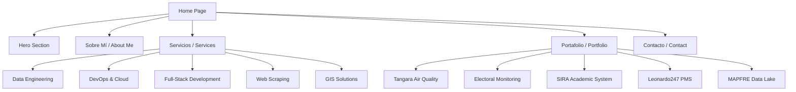
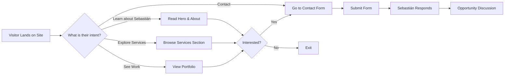
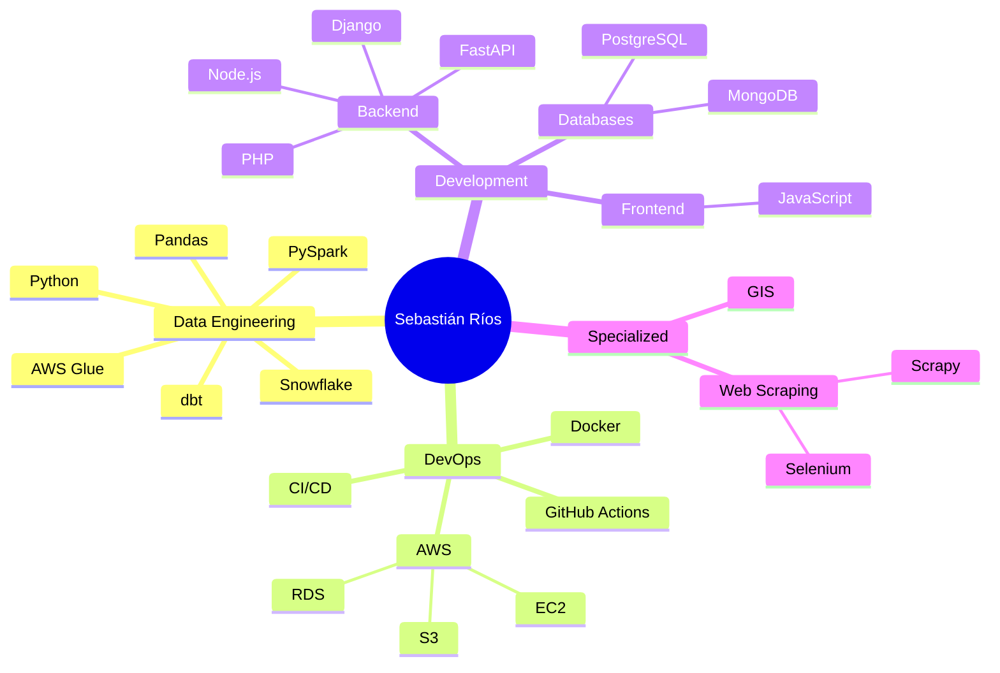

# Portfolio Website Plan for Sebastián Ríos Sabogal

## Executive Summary

This document outlines the architecture, design, and implementation plan for a professional portfolio website for Sebastián Ríos Sabogal, a Systems Engineer and Data Engineer/DevOps specialist. The site will serve as a marketing tool to attract full-time job opportunities from both B2B and B2C segments.

---

## 1. Project Overview

### 1.1 Goals
- **Primary:** Attract full-time job opportunities
- **Secondary:** Showcase technical expertise and projects
- **Tertiary:** Establish thought leadership in Data Engineering and DevOps

### 1.2 Target Audience
| Segment | Description | Key Interests |
|---------|-------------|---------------|
| B2B - Tech Companies | Software companies, startups, consultancies | Full-stack development, cloud infrastructure, data pipelines |
| B2B - NGOs/Foundations | Non-profits, international organizations | GIS solutions, data collection, sustainable tech |
| B2C - Individuals | Entrepreneurs, small businesses | Consulting, training, custom solutions |

### 1.3 Design Direction
- **Theme:** Modern dark theme with accent colors
- **Primary Colors:** Dark slate (#0f172a), Accent teal (#14b8a6), White text
- **Typography:** Inter (sans-serif) for body, JetBrains Mono for code snippets
- **Style:** Clean, professional, tech-forward

---

## 2. Site Architecture

### 2.1 Site Map



### 2.2 File Structure

```
portfolio/
├── index.html              # Main HTML file
├── css/
│   └── styles.css          # Custom CSS overrides
├── js/
│   └── main.js             # JavaScript interactions
├── assets/
│   ├── images/
│   │   ├── profile.jpg     # Professional photo
│   │   ├── projects/       # Project screenshots
│   │   └── icons/          # Custom icons
│   └── documents/
│       └── cv-sebastianrioss-esp.pdf
└── README.md
```

---

## 3. Section Specifications

### 3.1 Hero Section

**Purpose:** Create immediate impact and communicate value proposition

**Content:**
- **Headline:** "Transformando Datos en Soluciones Tecnológicas de Alto Impacto"
- **Subheadline:** "Ingeniero de Sistemas especializado en Data Engineering, DevOps y Desarrollo Full-Stack"
- **CTA Primary:** "Ver Proyectos" → Scrolls to Portfolio
- **CTA Secondary:** "Contactar" → Opens contact form
- **Visual:** Animated code/data visualization background or professional photo

**Key Elements:**
```
┌─────────────────────────────────────────────────────────────┐
│  [Logo/Name]                           [Nav: About | Services | Portfolio | Contact]  │
├─────────────────────────────────────────────────────────────┤
│                                                             │
│           Transformando Datos en Soluciones                 │
│              Tecnológicas de Alto Impacto                   │
│                                                             │
│    Ingeniero de Sistemas | Data Engineer | DevOps           │
│                                                             │
│         [Ver Proyectos]     [Contactar]                     │
│                                                             │
│    [Tech Stack Icons: Python | AWS | Docker | PostgreSQL]   │
│                                                             │
└─────────────────────────────────────────────────────────────┘
```

### 3.2 Sobre Mí / About Me Section

**Purpose:** Build trust through professional narrative

**Content Structure:**
1. **Professional Summary:** 2-3 paragraphs connecting experience to value
2. **Key Stats:** Years of experience, projects completed, technologies mastered
3. **Personal Touch:** Volunteer work, open-source contributions, passions

**Narrative Focus:**
- Journey from GIS development to Data Engineering
- International project experience (MAPFRE Spain, Panama elections, etc.)
- Commitment to open-source and environmental activism (Tangara project)

**Visual Elements:**
- Professional photo
- Timeline of career progression
- Technology proficiency bars/icons

### 3.3 Servicios / Services Section

**Purpose:** Clearly define offerings for potential employers/clients

**Service Cards:**

| Service | Description | Technologies | Ideal For |
|---------|-------------|--------------|-----------|
| **Data Engineering** | ETL pipelines, data lakes, data transformation | Python, Spark, dbt, Snowflake, AWS Glue | Companies needing data infrastructure |
| **DevOps & Cloud** | CI/CD pipelines, cloud infrastructure, automation | AWS, Docker, GitHub Actions, Bash | Organizations modernizing deployment |
| **Full-Stack Development** | Web applications, APIs, database integration | Python, PHP, JavaScript, Node.js, PostgreSQL | Custom software projects |
| **Web Scraping** | Data extraction, automation, processing | Python, Selenium, Scrapy | Data collection needs |
| **GIS Solutions** | Geographic information systems, field data collection | Node.js, Firebase, Mobile | Environmental, agricultural projects |

**Visual Design:**
- Card-based layout with icons
- Hover effects showing more details
- CTA for each service: "Consultar"

### 3.4 Portafolio / Portfolio Section

**Purpose:** Demonstrate capabilities through real projects

**Featured Projects:**

#### Project 1: Tangara - Air Quality Monitoring Network
- **Role:** Backend Developer & Data Engineer
- **Organization:** Chispa NGO
- **Duration:** 2020 - Present
- **Description:** Citizen activism network for air quality monitoring using low-cost sensors and open-source technologies
- **Technologies:** Python, FastAPI, Docker, PostgreSQL, MongoDB, GitHub Actions
- **Impact:** Environmental governance promotion in Cali, Colombia
- **Links:** GitHub, Live Demo

#### Project 2: Electoral Monitoring System
- **Role:** Web Scraping Developer
- **Organization:** Fundación Herencia Cultural Guatemalteca
- **Duration:** Feb-May 2024
- **Description:** Scraped and processed ~340,000 electoral documents from Panama and El Salvador elections
- **Technologies:** Python, Selenium, Bash, AWS S3, Blockchain signing
- **Impact:** Electoral transparency and data integrity
- **Links:** FiscalDigital.net

#### Project 3: SIRA - Academic Registration System
- **Role:** Full-Stack Developer
- **Organization:** Universidad del Valle
- **Duration:** Jul-Dec 2024
- **Description:** Maintenance and enhancement of institutional academic registration system
- **Technologies:** PHP, JavaScript, PostgreSQL
- **Impact:** Improved system functionality for academic processes

#### Project 4: Leonardo247 - Property Management System
- **Role:** Backend Developer
- **Organization:** NETMIDAS / Fountain City Tech
- **Duration:** 2019-2023
- **Description:** International property management software development
- **Technologies:** Python, Django, MongoDB, AWS EC2, Docker
- **Impact:** Scalable property management solution

#### Project 5: MAPFRE Data Lake
- **Role:** Data Engineer
- **Organization:** NETMIDAS / Bision Consulting
- **Duration:** 2019-2023
- **Description:** Business Intelligence data lake pipeline for MAPFRE Spain
- **Technologies:** Snowflake, Python, AWS
- **Impact:** Enhanced BI capabilities for insurance operations

**Visual Design:**
- Grid layout with project cards
- Filter by technology/category
- Modal or expandable details
- Screenshots/mockups where available

### 3.5 Contacto / Contact Section

**Purpose:** Enable easy communication

**Elements:**
1. **Contact Form:**
   - Name (required)
   - Email (required)
   - Company/Organization
   - Project Type (dropdown)
   - Message
   - Submit button

2. **Direct Contact:**
   - Email: sebaxtianrioss@gmail.com
   - Phone: +57 3192703291
   - Location: Bogotá, Colombia

3. **Professional Links:**
   - LinkedIn: linkedin.com/in/sebastianriossabogal
   - Personal Site: about.me/sebaxtian
   - Blog: ideafalaz.blogspot.com
   - GitHub: (if available)

4. **Download CV:** Button to download PDF CV

---

## 4. Technical Specifications

### 4.1 Technology Stack

| Layer | Technology | Purpose |
|-------|------------|---------|
| Structure | HTML5 | Semantic markup |
| Styling | Tailwind CSS | Responsive design, utility classes |
| Interactivity | Vanilla JavaScript | Smooth scrolling, form handling, animations |
| Icons | Heroicons / Font Awesome | Visual elements |
| Fonts | Google Fonts (Inter, JetBrains Mono) | Typography |

### 4.2 Responsive Breakpoints

```css
/* Mobile First Approach */
sm: 640px   /* Small devices */
md: 768px   /* Tablets */
lg: 1024px  /* Laptops */
xl: 1280px  /* Desktops */
2xl: 1536px /* Large screens */
```

### 4.3 SEO Optimization

**Meta Tags:**
- Title: "Sebastián Ríos Sabogal | Data Engineer & DevOps Specialist"
- Description: "Ingeniero de Sistemas especializado en Data Engineering, DevOps y desarrollo Full-Stack. Transformando datos en soluciones tecnológicas de alto impacto."
- Keywords: data engineer, devops, full-stack developer, AWS, Python, Colombia
- Open Graph tags for social sharing
- Structured data (JSON-LD) for person schema

**Performance:**
- Lazy loading for images
- Minified CSS/JS
- Optimized images (WebP format)
- Preconnect to external resources

### 4.4 Accessibility

- WCAG 2.1 AA compliance
- Proper heading hierarchy
- Alt text for images
- Keyboard navigation
- Focus indicators
- Color contrast ratios ≥ 4.5:1

---

## 5. Visual Design Specifications

### 5.1 Color Palette

```css
:root {
  /* Primary */
  --bg-primary: #0f172a;      /* Slate 900 */
  --bg-secondary: #1e293b;    /* Slate 800 */
  --bg-tertiary: #334155;     /* Slate 700 */
  
  /* Accent */
  --accent-primary: #14b8a6;  /* Teal 500 */
  --accent-secondary: #2dd4bf; /* Teal 400 */
  --accent-glow: #5eead4;     /* Teal 300 */
  
  /* Text */
  --text-primary: #f8fafc;    /* Slate 50 */
  --text-secondary: #cbd5e1;  /* Slate 300 */
  --text-muted: #94a3b8;      /* Slate 400 */
  
  /* Status */
  --success: #22c55e;         /* Green 500 */
  --warning: #f59e0b;         /* Amber 500 */
  --error: #ef4444;           /* Red 500 */
}
```

### 5.2 Typography Scale

```css
/* Font Sizes */
--text-xs: 0.75rem;    /* 12px */
--text-sm: 0.875rem;   /* 14px */
--text-base: 1rem;     /* 16px */
--text-lg: 1.125rem;   /* 18px */
--text-xl: 1.25rem;    /* 20px */
--text-2xl: 1.5rem;    /* 24px */
--text-3xl: 1.875rem;  /* 30px */
--text-4xl: 2.25rem;   /* 36px */
--text-5xl: 3rem;      /* 48px */
--text-6xl: 3.75rem;   /* 60px */
```

### 5.3 Component Styles

**Buttons:**
- Primary: Teal background, white text, rounded-lg, hover glow effect
- Secondary: Transparent border, teal border, teal text, hover fill
- Sizes: sm, md, lg

**Cards:**
- Background: Slate 800 with subtle gradient
- Border: 1px Slate 700
- Border-radius: 12px
- Shadow: Subtle drop shadow
- Hover: Scale 1.02, enhanced shadow

---

## 6. Implementation Checklist

### Phase 1: Structure
- [ ] Create HTML5 boilerplate with semantic structure
- [ ] Implement Tailwind CSS via CDN
- [ ] Set up Google Fonts
- [ ] Create navigation component

### Phase 2: Content Sections
- [ ] Build Hero section with animations
- [ ] Create About Me section with timeline
- [ ] Develop Services section with cards
- [ ] Implement Portfolio grid with filters
- [ ] Add Contact form and links

### Phase 3: Interactivity
- [ ] Smooth scroll navigation
- [ ] Mobile menu toggle
- [ ] Form validation
- [ ] Scroll-triggered animations
- [ ] Project card interactions

### Phase 4: Optimization
- [ ] SEO meta tags and structured data
- [ ] Image optimization
- [ ] Performance testing
- [ ] Accessibility audit
- [ ] Cross-browser testing

---

## 7. Content Drafts

### 7.1 Hero Section Copy

**Headline:**
> Transformando Datos en Soluciones Tecnológicas de Alto Impacto

**Subheadline:**
> Ingeniero de Sistemas con más de 10 años de experiencia en Data Engineering, DevOps y Desarrollo Full-Stack. Especializado en AWS, Python y soluciones escalables en la nube.

### 7.2 About Me Copy

**Professional Summary:**
> Soy un Ingeniero de Sistemas egresado de la Universidad del Valle con una pasión por transformar datos en soluciones tecnológicas que generan impacto real. Mi trayectoria profesional abarca desde el desarrollo de Sistemas de Información Geográfica hasta la implementación de pipelines de datos a gran escala para empresas internacionales como MAPFRE España.
>
> Mi experiencia combina el desarrollo técnico con un compromiso social, liderando proyectos como Tangara, una red de monitoreo de calidad del aire que promueve la gobernanza ambiental en Cali. Creo firmemente en el poder de la tecnología para crear soluciones sostenibles y en la importancia del código abierto como motor de innovación.
>
> Actualmente, me desempeño como Data Engineer y DevOps en Solidaridad Colombia, donde diseño arquitecturas en AWS y desarrollo procesos ETL que apoyan prácticas sostenibles en cadenas de valor agropecuarias.

### 7.3 Services Copy

**Data Engineering:**
> Diseño e implementación de pipelines ETL escalables, data lakes y procesos de transformación de datos. Experiencia con AWS Glue, Snowflake, dbt y PySpark para manejar grandes volúmenes de datos.

**DevOps & Cloud:**
> Configuración y gestión de infraestructura en AWS, implementación de pipelines CI/CD con GitHub Actions, y automatización de despliegues con Docker. Enfoque en alta disponibilidad y eficiencia de costos.

**Full-Stack Development:**
> Desarrollo de aplicaciones web completas con Python (Django, FastAPI), PHP, JavaScript y Node.js. Integración con bases de datos PostgreSQL, MongoDB y servicios en la nube.

**Web Scraping:**
> Extracción automatizada de datos web con Python, Selenium y Scrapy. Experiencia en proyectos de gran escala como monitoreo electoral internacional.

**GIS Solutions:**
> Desarrollo de Sistemas de Información Geográfica para recolección y análisis de datos espaciales. Aplicaciones móviles y web para trabajo de campo.

---

## 8. Mermaid Diagrams

### 8.1 User Journey Flow



### 8.2 Technology Stack Visualization



---

## 9. Next Steps

1. **Review this plan** and confirm the structure and content approach
2. **Provide additional assets** (professional photo, project screenshots)
3. **Approve design direction** (dark theme with teal accents)
4. **Switch to Code mode** for implementation

---

## 10. Questions for Confirmation

1. Do you have a professional photo you'd like to use?
2. Are there any projects you'd prefer not to highlight?
3. Would you like a blog section or link to your existing blog?
4. Do you want the contact form to actually send emails (requires backend) or just open email client?
5. Any specific achievements or metrics you'd like to highlight?

---

*Document created: February 24, 2026*
*Author: Kilo Code (Architect Mode)*
