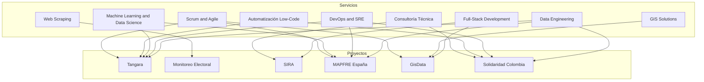

# Plan de Actualización: Servicios y Especialidades

## Resumen Ejecutivo

Basado en el análisis de los documentos `Profile_Linkedin_Sebastian.pdf` y `cv-sebastianrioss-esp.pdf`, se propone una actualización integral de la sección de Servicios y Especialidades del portafolio web para reflejar las certificaciones, trainings y experiencia documentada.

---

## Análisis de Certificaciones y Trainings

### Certificaciones Prioritarias (Solicitadas)

| Certificación | Fecha | Institución | Evidencia en Proyectos |
|---------------|-------|-------------|------------------------|
| Automatizaciones Low-Code con N8N | Dic. 2025 | Platzi | GitHub Actions pipelines en Tangara; CI/CD en Solidaridad |
| Herramientas de IA para Equipos de Datos | Oct. 2025 | Platzi | Data validation con ML en sensores Tangara |
| Diplomado Machine Learning and Data Science | Ene. 2025 | Univ. Nacional | Pipeline COVID-19 con Kedro; análisis datos ambientales |
| Artificial Intelligence in Remote Sensing | Jul. 2023 | Univ. de los Andes | Proyectos GIS en GEOPROCESS; análisis espacial |
| Big Data | Dic. 2024 | Univ. Nacional | AWS Glue, PySpark en Solidaridad; Snowflake en MAPFRE |
| Fundamentos de DevOps y SRE | Jul. 2025 | Univ. Nacional | Infraestructura AWS, monitoreo, CI/CD |
| Scrum for Developers Certification | Nov. 2019 | iCertify | Equipos Scrum en NETMIDAS y GEOPROCESS |

### Certificaciones Complementarias

| Certificación | Fecha | Institución |
|---------------|-------|-------------|
| Arquitectura de Software a Gran Escala | Jun. 2025 | Univ. Nacional |
| Introducción al Machine Learning | Nov. 2024 | Univ. Nacional |
| Automation in the AWS Cloud | Oct. 2024 | Coursera |
| DevOps on AWS and Project Management | Oct. 2024 | Coursera |
| Análisis y Visualización de Datos | Sep. 2024 | Univ. Nacional |
| AWS Fundamentals: Going Cloud-Native | Ago. 2020 | Coursera |
| Hands-on Essentials - Data Warehouse | Oct. 2022 | Snowflake |

---

## Propuesta de Servicios Actualizados

### 1. Data Engineering (Existente - Mejorar)

**Descripción actual:** Diseño e implementación de pipelines ETL escalables, data lakes y procesos de transformación de datos.

**Propuesta de mejora:**
- Agregar Big Data como diferenciador
- Incluir tecnologías: AWS Glue, PySpark, Snowflake, dbt

**Evidencia:**
- Solidaridad Colombia: Big Data y transformación de datos
- MAPFRE España: Data lake con Snowflake
- Tangara: ETLs con Pandas, GitHub Actions

**Tags propuestos:** `AWS Glue` `Snowflake` `dbt` `PySpark` `Big Data`

---

### 2. DevOps & SRE (Existente - Actualizar)

**Descripción actual:** DevOps & Cloud - Configuración y gestión de infraestructura en AWS, implementación de pipelines CI/CD y automatización de despliegues.

**Propuesta de actualización:**
- Cambiar nombre a "DevOps & SRE"
- Incluir Site Reliability Engineering
- Agregar monitoreo y observabilidad

**Evidencia:**
- Solidaridad Colombia: Automatización, monitoreo, CI/CD
- Certificación: Fundamentos de DevOps y SRE (Jul. 2025)
- NETMIDAS: Docker, Vagrant, AWS EC2

**Tags propuestos:** `AWS` `Docker` `GitHub Actions` `CI/CD` `SRE` `Monitoreo`

---

### 3. Full-Stack Development (Existente - Mantener)

**Descripción:** Desarrollo de aplicaciones web completas con APIs REST, integración de bases de datos y servicios en la nube.

**Evidencia:**
- Universidad del Valle: SIRA con PHP, JavaScript, PostgreSQL
- NETMIDAS: Django REST, Auth0, MongoDB
- GEOPROCESS: Node.js, Firebase

**Tags:** `Python` `FastAPI` `Django` `Node.js` `PHP`

---

### 4. Web Scraping (Existente - Mantener)

**Descripción:** Extracción automatizada de datos web a gran escala, procesamiento y almacenamiento estructurado.

**Evidencia:**
- Fundación HCG: ~340,000 actas electorales (Panamá y El Salvador)
- Integración con AWS S3 y blockchain
- Tecnologías: Python, Selenium, Scrapy

**Tags:** `Python` `Selenium` `Scrapy` `AWS S3`

---

### 5. GIS Solutions (Existente - Mantener)

**Descripción:** Sistemas de Información Geográfica para recolección y análisis de datos espaciales en campo.

**Evidencia:**
- GEOPROCESS: GisData, censos arbóreos
- Certificación: Artificial Intelligence in Remote Sensing
- Universidad del Valle: GISMODEL, SIGELAB

**Tags:** `Node.js` `Firebase` `Mobile` `Maps` `Remote Sensing`

---

### 6. Machine Learning & Data Science (NUEVO)

**Descripción:** Implementación de modelos de machine learning y análisis de datos para toma de decisiones informadas. Integración de IA en pipelines de datos existentes.

**Evidencia:**
- Diplomado Machine Learning and Data Science (Univ. Nacional, 2025)
- Artificial Intelligence in Remote Sensing (Univ. de los Andes, 2023)
- Herramientas de IA para Equipos de Datos (Platzi, 2025)
- Pipeline COVID-19 con Kedro en NETMIDAS
- Validación de datos con ML en Tangara

**Tags:** `Python` `Pandas` `Scikit-learn` `Jupyter` `Kedro`

---

### 7. Automatización Low-Code (NUEVO)

**Descripción:** Automatización de flujos de trabajo y procesos empresariales utilizando herramientas low-code como N8N. Integración de sistemas y APIs sin necesidad de código complejo.

**Evidencia:**
- Certificación: Automatizaciones Low-Code con N8N (Platzi, Dic. 2025)
- GitHub Actions pipelines en Tangara
- Automatización de despliegues en Solidaridad Colombia
- CI/CD en múltiples proyectos

**Tags:** `N8N` `GitHub Actions` `Zapier` `Integraciones` `Workflows`

---

### 8. Scrum & Agile Development (NUEVO)

**Descripción:** Metodologías ágiles para desarrollo de software. Implementación de prácticas Scrum para equipos de desarrollo eficientes y entregas iterativas.

**Evidencia:**
- The Complete Scrum for Developers Certification (iCertify, 2019)
- Equipos Scrum en NETMIDAS
- Implementación Scrum en GEOPROCESS
- User Stories y pruebas funcionales en Universidad del Valle

**Tags:** `Scrum` `Sprint Planning` `User Stories` `Agile` `Sprint Review`

---

### 9. Consultoría Técnica (Existente - Mantener)

**Descripción:** Asesoramiento en arquitectura de software, mejores prácticas de desarrollo y estrategia de datos.

**Evidencia:**
- Arquitectura de Software a Gran Escala (Univ. Nacional, 2025)
- Propuestas de mejoras y clean code en SIRA
- Diseño de arquitecturas en AWS

**Tags:** `Arquitectura` `Best Practices` `Mentoring` `Clean Code`

---

## Actualización de Competencias Técnicas

### Skills Actuales (index.html líneas 266-283)
```
Python, AWS, Docker, PostgreSQL, MongoDB, FastAPI, Django, ETL, CI/CD, 
Snowflake, dbt, PySpark, GitHub Actions, Linux, Node.js, PHP
```

### Skills Propuestas (Agregar)
```
N8N, Pandas, Scikit-learn, Jupyter, Kedro, Selenium, Scrapy, 
Machine Learning, Big Data, SRE
```

---

## Mapeo de Servicios a Proyectos



---

## Implementación

### Archivo a Modificar
- `index.html` - Sección Services (líneas 321-451)

### Cambios Requeridos

1. **Actualizar servicio DevOps & Cloud → DevOps & SRE**
   - Líneas 355-372
   - Agregar SRE y monitoreo

2. **Agregar servicio Machine Learning & Data Science**
   - Nuevo bloque después de GIS Solutions
   - Incluir icono de cerebro/red neuronal

3. **Agregar servicio Automatización Low-Code**
   - Nuevo bloque
   - Incluir icono de workflow/automatización

4. **Agregar servicio Scrum & Agile Development**
   - Nuevo bloque
   - Incluir icono de equipo/iteración

5. **Actualizar Competencias Técnicas**
   - Líneas 266-283
   - Agregar nuevas tecnologías

---

## Checklist de Evidencia

| Servicio | Certificación | Proyecto Real | Tecnologías |
|----------|---------------|---------------|-------------|
| Data Engineering | Big Data, Snowflake | MAPFRE, Solidaridad | AWS Glue, PySpark, dbt |
| DevOps & SRE | Fundamentos DevOps y SRE | Solidaridad, NETMIDAS | AWS, Docker, CI/CD |
| Full-Stack | - | SIRA, GisData | PHP, Python, Node.js |
| Web Scraping | - | Monitoreo Electoral | Selenium, Scrapy |
| GIS Solutions | AI in Remote Sensing | GisData | Node.js, Firebase |
| ML & Data Science | Diplomado ML, AI Tools | Tangara, COVID Pipeline | Pandas, Scikit-learn |
| Low-Code | N8N Platzi | Tangara, Solidaridad | N8N, GitHub Actions |
| Scrum & Agile | Scrum Certification | NETMIDAS, GEOPROCESS | Scrum, Agile |

---

## Próximos Pasos

1. Aprobar el plan de actualización
2. Cambiar a modo Code para implementar cambios
3. Actualizar sección de Servicios en index.html
4. Actualizar sección de Competencias Técnicas
5. Verificar responsividad y diseño
6. Probar en navegador

---

*Documento generado: 2026-02-24*
*Basado en: Profile_Linkedin_Sebastian.pdf y cv-sebastianrioss-esp.pdf*
